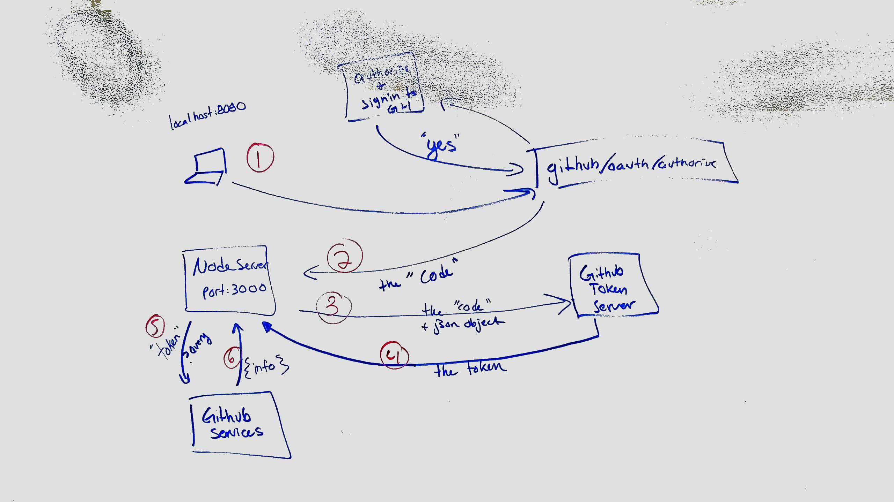

 LAB 17
=================================================

## Project Name: OAUTH - {Git Hub}

### Author: Hannah Ingham, Jon DiQuattro, George Raymond, and Ryan Gallaway

### Links and Resources
* [web-server repo](https://github.com/rkgallaway/17-oauth-web-server)
* [auth-server repo](https://github.com/rkgallaway/17-oauth-auth-server)

* [back-end auth-server demo](https://lab17-oauth-auth-server.herokuapp.com) 
* [back-end web-server demo](https://lab17-oauth-web-server.herokuapp.com) 

* [front-end demo](localhost:8080)

#### Documentation
* [assessment report](./REPORT.md)

### Modules
#### `auth/middleware/oauth/github.js`
* Must have a Github account in order to test

##### Implementation Notes
* Server not secured, not required, used Oauth
* .env: CLIENT_ID, GITHUB_ID_SECRET
* nodemon on localhost:3000 
* nodemon on localhost:8080
* OAuth Link: localhost:3000/oauth

#### UML
